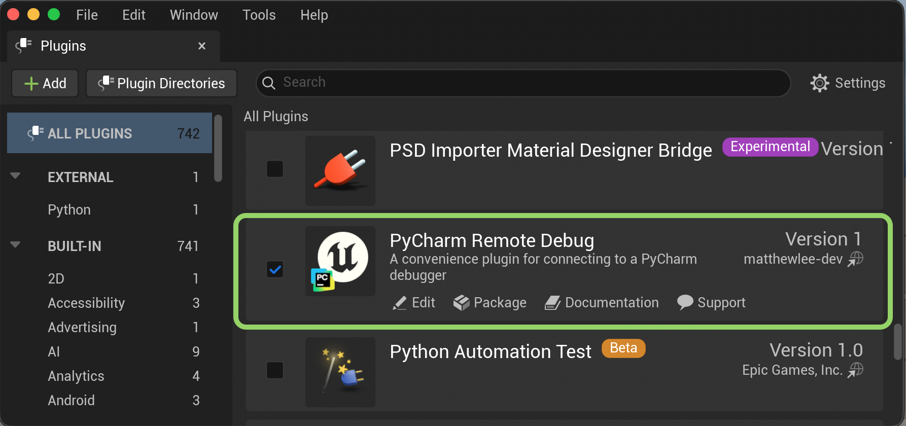
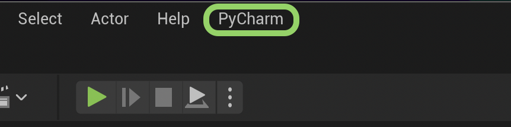
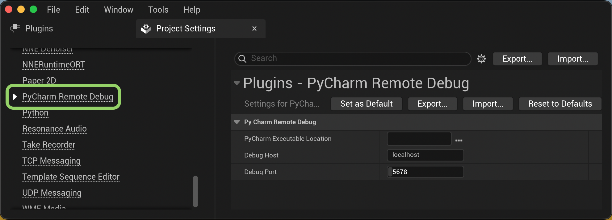

# Installation

## Quickstart

  <iframe src="https://www.youtube-nocookie.com/embed/Qam3UiHd_Us"
          title="Unreal PyCharm Remote Debug quickstart"
          allowfullscreen loading="lazy"></iframe>

## Prerequisites

1. [Unreal Engine 5](https://www.unrealengine.com) - Windows, macOS or Linux.
2. [PyCharm Professional](https://www.jetbrains.com/pycharm/buy/) (Community is not supported).
3. `PythonScriptPlugin` - ships with Unreal, enabled automatically with this plugin.

## 1. Unreal setup

### From Fab (recommended)

1. Add the plugin to your library from the [Fab listing page](https://www.fab.com).
2. In the Epic Games Launcher, open your project and use **Add to Project** on the listing.
3. Enable under Edit -> Plugins, restart if prompted.

A **PyCharm** menu appears in the level editor.

??? note "From a manual download"

    Needs Visual Studio (Windows) or Xcode (macOS) - the editor compiles the
    source on first open.

    1. Download the zip for your engine version from [Releases](https://github.com/matthewlee-dev/unreal-pycharm-remote-debug/releases).
    2. Extract into `YourProject/Plugins/`.
    3. Open the project and answer **Yes** to the rebuild prompt.
    4. Enable under Edit -> Plugins, restart if prompted.

### Plugin settings

!!! warning "Required"
    **Connect** fails until **PyCharm Executable Location** is set.

Edit -> Project Settings -> Plugins -> **PyCharm Remote Debug**. Set **PyCharm
Executable Location** and **Debug Port** (default `5678`). Leave **Debug Host** as
`localhost` unless PyCharm is on another machine.

| Platform | Typical PyCharm Executable Location |
| --- | --- |
| Windows | `C:\Program Files\JetBrains\PyCharm 2025.1\bin\pycharm64.exe` |
| macOS | `/Applications/PyCharm.app` |
| Linux | `/opt/pycharm-2025.1/bin/pycharm.sh` |

## 2. PyCharm setup

### Debug Server

1. Run -> Edit Configurations, click **+**, choose **Python Debug Server**.
2. Name it ___Unreal___. Set **IDE host name** to `localhost` and **Port** to match
   **Debug Port** above. Leave path mappings empty on one machine.

    !!! note
        Ignore the panel's `pip install pydevd-pycharm` instruction.

3. Run -> Debug ___Unreal___. The console shows `Waiting for process connection...`.

## Connecting

Level editor: PyCharm -> Connect.

Breakpoints now hit, and can be set before or after connecting. PyCharm ->
Disconnect when done.

!!! tip
    Debugging a different machine? See [Remote Setup](remote-setup.md).
    Connect failing? See [Troubleshooting](support.md#troubleshooting).
